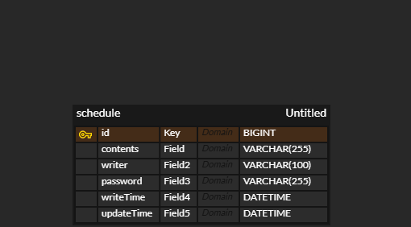

# scheduler

## 신규 일정 등록
method: POST

url: /schedules

request: 요청 body

response: 등록 정보

-성공: 상태코드 201, 저장된 일정 정보를 response body로 반환.

>Request Body (JSON) 예시
```json
{
  "contents": "contents1",
  "writer": "writer1",
  "password": "password1",
  "writeTime": "2025-05-24",
  "updateTime": "2025-05-24"
}
```

> Response 

```json
{
  "id": 9,
  "contents": "contents1",
  "writer": "writer1",
  "writeTime": "2025-05-24",
  "updateTime": "2025-05-24"
}
```

## 일정 목록 조회
method: GET

url: /schedules or /schedules?writer=writer or /schedules?updateTime=yyyy-mm-dd or /schedules?updateTime=yyyy-mm-dd&writer=writer
request: 요청 param

response: 다건 응답 정보

-성공: 상태코드 200, 조건에 맞는 일정들을 수정일에 내림차순하게 반환

> Response Examples

 200 Response

```json
[
  {
    "id": 7,
    "contents": "contents7 수정",
    "writer": "writer7 수정",
    "writeTime": "2025-05-22",
    "updateTime": "2025-05-24"
  },

  {
    "id": 10,
    "contents": "contents8",
    "writer": "writer8",
    "writeTime": "2025-05-24",
    "updateTime": "2025-05-24"
  },
  {
    "id": 5,
    "contents": "title3 수정",
    "writer": "writer3 수정",
    "writeTime": "2025-05-21",
    "updateTime": "2025-05-22"
  },
  {
    "id": 8,
    "contents": "title4 수정",
    "writer": "writer4 수정",
    "writeTime": "2025-05-22",
    "updateTime": "2025-05-22"
  }
]
```

## 일정 조회
method: GET

url: /schedules/{id}

request: 요청 param

response: 단건 응답 정보

-성공: 상태코드 200, id에 맞는 일정정보 반환

> Response Examples

```json
{
  "id": 9,
  "contents": "contents1",
  "writer": "writer1",
  "writeTime": "2025-05-24",
  "updateTime": "2025-05-24"
}
```


## 일정 수정
method: PATCH

url: /schedules/{id}

request: 요청 body

response: 수정 정보

-성공: 상태코드 200, 조건에 맞는 일정들을 수정일에 내림차순으로 반환

-실패: 요청 body의 password와 저장된 password가 일치하지 않는 경우 상태코드 400반환.

> Body Parameters
```json
{
  "contents": "contents7 수정",
  "writer": "writer7 수정",
  "password": "password4"
}
```

> Response Examples
> 200 Response
```json
{
  "id": 7,
  "contents": "contents7 수정",
  "writer": "writer7 수정",
  "writeTime": "2025-05-22",
  "updateTime": "2025-05-24"
}
```
> 400 Response
```json
{
  "timestamp": "2025-05-23T16:18:01.470+00:00",
  "status": 400,
  "error": "Bad Request",
  "path": "/schedules/7"
}
```


## 일정삭제
method: DELETE

url: /schedules/{id}

request: 요청 param

response: 상태코드

-성공: 상태코드 200

-실패: 
  1. 삭제하려는 데이터가 없는 경우: 상태코드 404(NOT FOUND) 반환
  2. 비밀번호가 일치하지 않는 경우: 상태코드 400(Bad Request)반환

> Body Parameters

```json
{
  "password": "password1",
}
```

> Response Examples

> 200 Response

```
{}
```

> 400 Response(비밀번호가 틀린 경우)

```json
{
  "timestamp": "2025-05-23T16:19:55.434+00:00",
  "status": 400,
  "error": "Bad Request",
  "path": "/schedules/6"
}
```

> 404 Response(삭제하려는 일정이 없는 경우)

```json
{
  "timestamp": "2025-05-23T16:18:50.144+00:00",
  "status": 404,
  "error": "Not Found",
  "path": "/schedules/1"
}
```

#ERD



